<div align="center">



<br/><br/>

[](mailto:sondaehyeon01@gmail.com)
[](https://www.linkedin.com/in/son-daehyeon)

</div>

<br/>

## 🧑‍💻 About Me

```typescript
const daehyeon = {
  company: "Zighang",
  role: "Product Owner",
  education: "Kookmin Univ. Software Engineering",

  domains: ["Backend", "Infrastructure", "Product"],
  motto: "Own the problem end-to-end.",
  // I design, build, ship, and operate —
  // from infrastructure to product decisions.
} as const;
```

<br/>

## 🛠️ Tech Stack

> ⚡ Main &nbsp;·&nbsp; 🔧 Experienced &nbsp;·&nbsp; 🌱 Familiar

#### Languages

⚡   

🔧   

🌱  

#### Backend

⚡   

🔧        

#### Frontend

⚡       

🔧   

🌱 

#### Data · Search · Messaging

⚡   

🔧      

#### Infra & DevOps

⚡   

🔧  

#### Testing & Monitoring

🔧    

#### Etc

🌱 

<br/>

## ⚡ Work @ [Zighang](https://zighang.com)

> Building a job discovery platform — owning the product from planning to production.

- 🔍 **In-house Search Engine** — designed & built from scratch, solo

  `Go` `PostgreSQL` `Vespa` `OpenSearch`

- 🚀 **Core Service** — backend & frontend development for the main job platform

  `Kotlin` `Spring Boot` `jOOQ` `Kafka` `OpenSearch` `Next.js`

- 🏗️ **Infrastructure** — service infrastructure & delivery pipelines

  `AWS` `GCS` `Docker` `GitHub Actions`

- 📊 **Product Ownership** — feature planning, prioritization, and data-driven decisions

  `PostHog` `Analytics`

<br/>

## 🎓 Activities

<div align="center">

| Period | Organization | Role |
|:------:|:------------:|:----:|
| 2026.07 ~ 2026.09 | [NEXTERS](https://nexters.co.kr) 29th | Backend Developer |
| 2025.09 ~ | [Zighang](https://zighang.com) | Product Owner |
| 2025.08 ~ 2025.12 | [KUSITMS](https://kusitms.com) 32nd | Member |
| 2025.01 ~ 2025.12 | [WINK](https://wink.kookmin.ac.kr) | Executive |
| 2024.03 ~ 2024.12 | [WINK](https://wink.kookmin.ac.kr) | Member |

</div>

<br/>

## 🏆 Achievements

<div align="center">

| 🏅 | Date | Competition |
|:--:|:----:|-------------|
| 🥇 | 2024.09 | WINK × The Compass Hackathon |
| 🥉 | 2024.09 | Sookmyung Code-it × KMU KOSS Hackathon |
| 🥉 | 2023.08 | Kookmin Univ. Algorithm Contest |
| 🎖️ | 2023.06 | Chungbuk Olympiad in Informatics |
| 🥇 | 2022.12 | Chungbuk Computer Festival |

</div>

<br/>

## 🚀 Projects

| Year | Project | Description | Tech |
|:----:|---------|-------------|------|
| 2026 | [거부기린](https://github.com/posture-turtle) | Posture correction service — grew from KUSITMS 32nd into a startup, backend | `Kotlin` `Spring Boot` |
| 2025 | [국동이](https://github.com/KookDongE-A) | Club discovery & recruiting platform for Kookmin Univ. | `Next.js` `Spring Boot` |
| 2025 | [Interpre](https://github.com/flex-interpre) | Real-time interpretation service powered by CLOVA STT | `Spring Boot` |
| 2025 | [IDEANTIFY](https://github.com/IDEANTIFY) | AI-powered idea validation & refinement platform | `Next.js` `Spring Boot` |
| 2025 | [직행으로 직행](https://github.com/zighang-zighang) | KUSITMS × Zighang collab — job posting recommendation service | `Next.js` `Spring Boot` |
| 2025 | [Classpick](https://github.com/classpick-alpha) | Real-time classroom reservation platform with OCR-based verification | `Next.js` `Spring Boot` |
| 2025 | [WINK DNS](https://github.com/son-daehyeon/wink-dns-server) | Subdomain registration & management service for club members | `Spring Boot` `Next.js` |
| 2025 | [Seoul IN Culture](https://github.com/KMU-WINK/seoul-in-culture-client) | Culture event discovery & meetup platform — Seoul Open Data Competition | `Next.js` `Spring Boot` |
| 2025 | [Tably](https://github.com/KMU-WINK/tably-server) | Shared-space reservation system for College of SW clubs | `Spring Boot` `Next.js` |
| 2024 | [WINK Official Website](https://github.com/KMU-WINK/wink-official-page-server) | Full-stack renewal of the club website — recruiting & member management | `Next.js` `Spring Boot` |
| 2024 | [Idea Bank](https://github.com/Cokothon-Idea-Bank) | Idea sharing platform (Hackathon 🥉) | `React` `Spring Boot` |
| 2024 | [Tripee](https://github.com/Winkathon-Tripee) | Travel planning & sharing platform (Hackathon 🥇) | `Svelte` `Spring Boot` |
| 2021 | [TriggerReactor](https://github.com/TriggerReactor/TriggerReactor) | Minecraft scripting plugin (Contributor) | `Java` |

<details>
<summary><b>📦 High school projects (2022 ~ 2023)</b></summary>

<br/>

| Year | Project | Description | Tech |
|:----:|---------|-------------|------|
| 2023 | [티플](https://github.com/JCHS-Teacher-Plan) | Timetable iOS app for teachers — released on the App Store | `Swift` `Spring Boot` |
| 2023 | [ALGORRITHM](https://github.com/JCHS-ALGORRITHM) | School online judge with a custom judging server | `React` `Spring Boot` |
| 2023 | [Classmate](https://github.com/JCHS-Classmate) | Timetable iOS app for students | `Swift` `Spring Boot` |
| 2022 | [Hakuna Matata](https://github.com/JCHS-Hakuna-Matata) | School goods shop | `React` `Node.js` |
| 2022 | [Music Player](https://github.com/JCHS-Music-Player) | Music streaming platform | `React` `Spring Boot` |
| 2022 | [Ignite](https://github.com/JCHS-Ignite) | School festival management bot | `Node.js` |

</details>

<br/>

## 📈 Contributions

<div align="center">


<br/><br/>

`$ exit`

</div>
